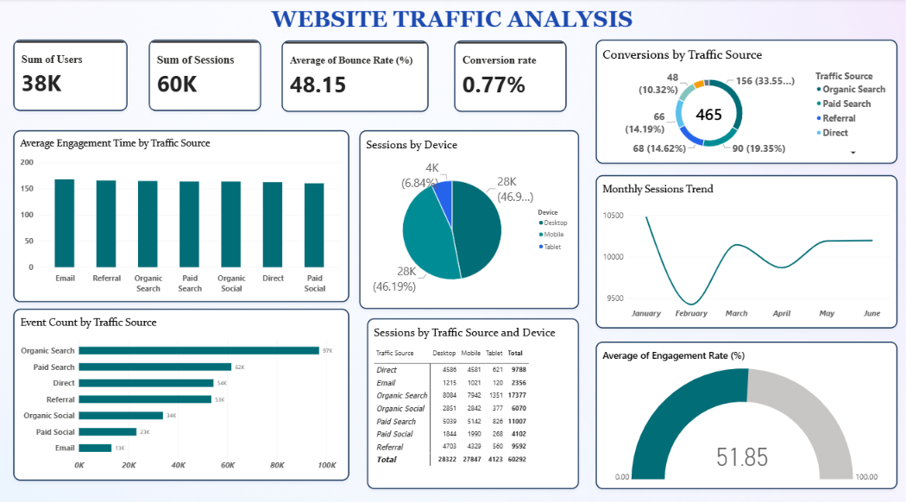
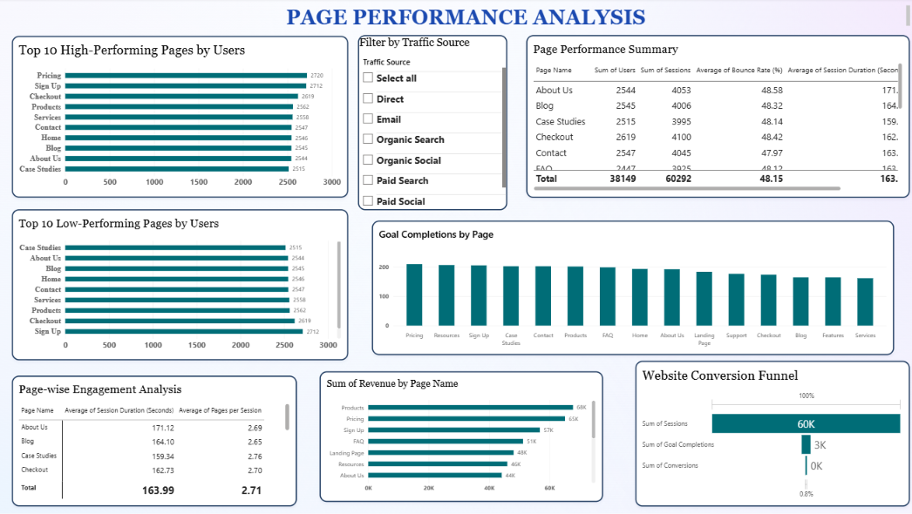

# Website Traffic Analysis Dashboard
A Power BI dashboard developed to analyze website traffic, user engagement, page performance, and conversion metrics.

# Tools & Technologies
- Microsoft Power BI
- Data Analysis
- Data Visualization

# Dashboard Overview
This project consists of two interactive dashboard pages:

# 1. Website Traffic Analysis
This page provides an overview of overall website traffic and user engagement.

# Visuals
- Total Users
- Total Sessions
- Average Bounce Rate
- Conversion Rate
- Conversions by Traffic Source
- Average Engagement Time by Traffic Source
- Sessions by Device
- Monthly Sessions Trend
- Event Count by Traffic Source
- Sessions by Traffic Source and Device
- Average Engagement Rate

# 2. Page Performance Analysis
This page focuses on individual page performance and conversion analysis.

# Visuals
- Top 10 High-Performing Pages by Users
- Top 10 Low-Performing Pages by Users
- Page Performance Summary
- Goal Completions by Page
- Page-wise Engagement Analysis
- Revenue by Page Name
- Website Conversion Funnel
- Traffic Source Filter

# Project Objective
The objective of this project is to analyze website traffic and page-level performance using Power BI and present meaningful insights through interactive visualizations.

# Dashboard Preview
# Page 1 – Website Traffic Analysis

### Page 2 – Page Performance Analysis

# Project File
The Power BI dashboard file is available in this repository:

`Website_Traffic.pbix`
